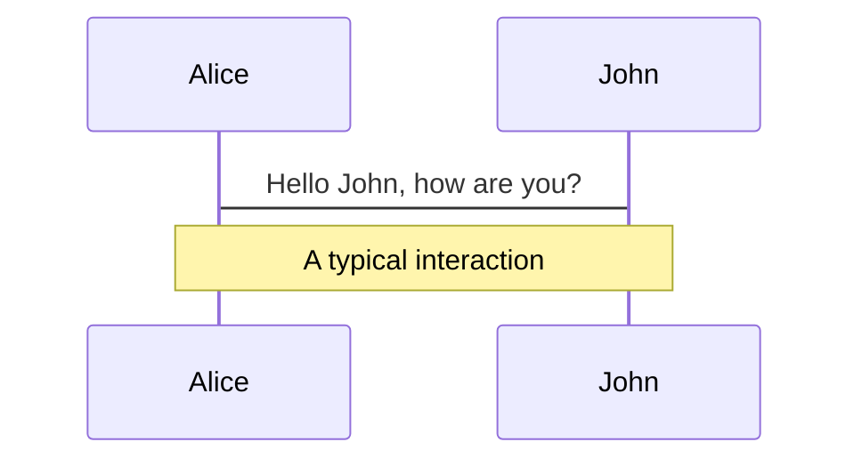
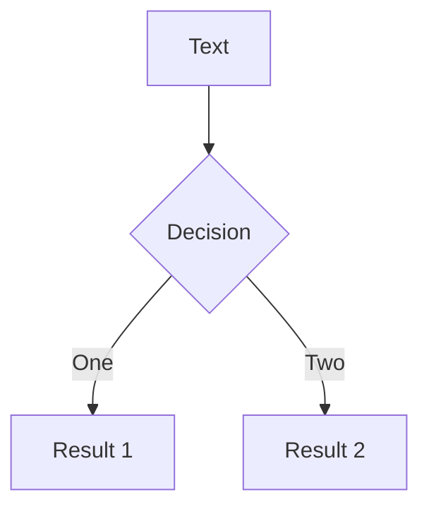
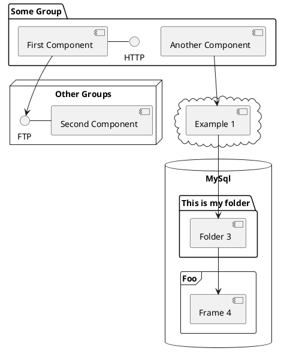

---
# try also 'default' to start simple
theme: seriph
# random image from a curated Unsplash collection by Anthony
# like them? see https://unsplash.com/collections/94734566/slidev
background: './bg-img.jpg'
title: '技术沙龙'
# apply any windi css classes to the current slide
class: 'text-center'
# https://sli.dev/custom/highlighters.html
highlighter: shiki
# show line numbers in code blocks
lineNumbers: false
# some information about the slides, markdown enabled
info: |
  ## Slidev Starter Template
  Presentation slides for developers.

  Learn more at [Sli.dev](https://sli.dev)
# persist drawings in exports and build
drawings:
  persist: false
---

# 浅谈JavaScript数据类型


<div class="pt-12">
  <span @click="$slidev.nav.next" class="px-2 py-1 rounded cursor-pointer" hover="bg-white bg-opacity-10">
    开始 <carbon:arrow-right class="inline"/>
  </span>
</div>

---


# JavaScript中的数据类型 

<div class="float-left">
<v-click>

### 基本数据类型

</v-click>

<v-click>

- Number(数字类型)
- String(字符串类型)
- Boolean(布尔类型)
- Undefined(Undefined类型)
- Null(Null类型)
  
</v-click>

<v-click>

es6新增：
- Symbol(符号类型)：唯一且不可修改的值
- BigInt(BigInt类型)：用来表示任意精度的整数

</v-click>

</div>

<div class="float-right mr-20">
<v-click>

### 引用数据类型

</v-click>

<v-click>

- Object(对象类型)
- Function(函数类型)
- Array(数组类型)
  
</v-click>
</div>

---

# 怎么判断数据类型

- #### typeof 运算符:返回一个字符串，表示未经运算的操作数的类型

<v-click>

##### 基本数据类型：

```ts {1|2|3|4|5,4|6|7,6|8|all}
- var a1 = 1                  typeof a1 --> 'number'
- var a2 = true               typeof a2 --> 'boolean'
- var a3 = undefined          typeof a3 --> 'undefined'
- var a4 = 'ticknet'          typeof a5 --> 'string'
- var a5 = 'ticknet'          a4 === a5 -->  true
- var a6 = Symbol('ticknet')  typeof a6 --> 'symbol'
- var a7 = Symbol('ticknet')  a6 === a7 -->  false
- var a8 = 42n                typeof a8 --> 'bigint' 
```

</v-click>

<v-click>


```ts{1,2|1,3|1,4|all}
特殊
- typeof(typeof(a7))  --> 'string'
- typeof NAN          --> 'number'
- typeof null         --> 'object'

解释：在 JavaScript 最初的实现中，JavaScript 中的值是由一个表示类型的标签和实际数据值表示的。
对象的类型标签是 0。由于 null 代表的是空指针（大多数平台下值为 0x00）
因此，null 的类型标签是 0，typeof null 也因此返回 "object"

曾有一个 ECMAScript 的修复提案（通过选择性加入的方式），但被拒绝了。该提案会导致 typeof null === 'null'。

```

</v-click>

---

# 构造函数，原型对象，原型链

<v-click>

##### 构造函数：是一种特殊的函数，主要用来初始化对象，即为对象成员变量赋初始值，它总与new操作符一起使用。我们可以把对象中一些公共的属性和方法抽取出来，然后封装到这个函数里面
</v-click>

<v-click>

##### new实例化过程：

</v-click>

<v-clicks>

 - 在内存中创建一个新的空对象
 - 将构造函数的作用域赋给这个对象(即让this就指向了这个对象)
 - 执行构造函数中的代码(为这个对象添加属性和方法，以及执行构造函数中其他的代码)
 - 将这个新对象返回(因此构造函数里面不需要return)
  
</v-clicks>

---
layout:
class: w-35vw h-60vh flex
---


```js
// 创建构造函数

function Person(name, nation) {
            this.name = name
            this.nation = nation
            this.introduce = function(nation) {
                console.log(`我的国籍是${this.nation}`)
            }
        }
var Dad = new Person("大明", "外国")
var Son = new Person("小明", "外国")
console.log(Dad)
console.log(Son)
Dad.introduce()
son.introduce()
```

<v-click>

<div style="background-image: url(" Page1.png " ) "  class="w-50vw h-50vh float-right"></div>

</v-click>

<v-click>
<div class="fixed mt-100 text-sm ml-2">构造函数方法虽然很好用但是会存在浪费内存的问题</div>
</v-click>

---

# 构造函数原型 prototype
```md

构造函数通过原型分配的函数是所有对象所共享的

JavaScript规定，每一个构造函数都有一个prototype属性，指向另一个对象。

这个prototype就是一个对象，这个对象的所有属性和方法，都会被构造函数所拥有

所有我们就可以把那些不变的方法，直接定义在prototype对象上，这样所有对象的实例就可以共享这种方法

```

```js{all|4,5,6|8,9,10|all}
function Person(name, nation) {
            this.name = name
            this.nation = nation
            this.introduce = function() {
                console.log(`${this.name}的国籍是${this.nation}`)
            }
        }
        Person.prototype.introduce = function() {
            console.log(`${this.name}的国籍是${this.nation}`)
        }
        
```


<style>
h1 {
  background-color: #2B90B6;
  background-image: linear-gradient(45deg, #4EC5D4 10%, #146b8c 20%);
  background-size: 100%;
  -webkit-background-clip: text;
  -moz-background-clip: text;
  -webkit-text-fill-color: transparent;
  -moz-text-fill-color: transparent;
}
</style>

---

# 那怎么判断数据的类型为Null？

#### 使用：Object.prototype.toString()

##### <br>每个对象都有一个 toString() 方法，当该对象被表示为一个文本值时，或者一个对象以预期的字符串方式引用时自动调用。  

##### 默认情况下，toString() 方法被每个 Object 对象继承。  

##### 如果此方法在自定义对象中未被覆盖，toString() 返回 "[object type]"，其中 type 是对象的类型。以下代码说明了这一点：
``` js


```

---

---

#### 引用数据类型

``` js
// 对象
typeof {a: 1} === 'object'

// 函数
typeof function() {} === 'function'

// 使用 Array.isArray() 或者 Object.prototype.toString.call()
// 区分数组和普通对象
typeof [1, 2, 4] === 'object'

//内置对象
typeof new Date() === 'object'
typeof /regex/ === 'object'

// 下面的例子令人迷惑，非常危险，没有用处。避免使用它们。
typeof new Boolean(true) === 'object'
typeof new Number(1) === 'object'
typeof new String('abc') === 'object'


```

---

# What is Slidev? // 最后一页

Slidev is a slides maker and presenter designed for developers, consist of the following features

- 📝 **Text-based** - focus on the content with Markdown, and then style them later
- 🎨 **Themable** - theme can be shared and used with npm packages
- 🧑‍💻 **Developer Friendly** - code highlighting, live coding with autocompletion
- 🤹 **Interactive** - embedding Vue components to enhance your expressions
- 🎥 **Recording** - built-in recording and camera view
- 📤 **Portable** - export into PDF, PNGs, or even a hostable SPA
- 🛠 **Hackable** - anything possible on a webpage

<br>
<br>
<div class="abs-br m-6 flex">
  <a href="https://github.com/slidevjs/slidev" target="_blank" alt="GitHub"
    class="text-xl icon-btn opacity-50 !border-none !hover:text-white">
    <carbon-logo-github />
  </a>
</div>

Read more about [Why Slidev?](https://sli.dev/guide/why)

<!--
You can have `style` tag in markdown to override the style for the current page.
Learn more: https://sli.dev/guide/syntax#embedded-styles
-->

<style>
h1 {
  background-color: #2B90B6;
  background-image: linear-gradient(45deg, #4EC5D4 10%, #146b8c 20%);
  background-size: 100%;
  -webkit-background-clip: text;
  -moz-background-clip: text;
  -webkit-text-fill-color: transparent;
  -moz-text-fill-color: transparent;
}
</style>

---

# Navigation

Hover on the bottom-left corner to see the navigation's controls panel, [learn more](https://sli.dev/guide/navigation.html)

### Keyboard Shortcuts

|     |     |
| --- | --- |
| <kbd>right</kbd> / <kbd>space</kbd>| next animation or slide |
| <kbd>left</kbd>  / <kbd>shift</kbd><kbd>space</kbd> | previous animation or slide |
| <kbd>up</kbd> | previous slide |
| <kbd>down</kbd> | next slide |

<!-- https://sli.dev/guide/animations.html#click-animations -->

<p v-after class="absolute bottom-23 left-45 opacity-30 transform -rotate-10">Here!</p>

---
layout: image-right
image: https://source.unsplash.com/collection/94734566/1920x1080

---

# Code

Use code snippets and get the highlighting directly![^1]

```ts {all|2|1-6|9|all}
interface User {
  id: number
  firstName: string
  lastName: string
  role: string
}

function updateUser(id: number, update: User) {
  const user = getUser(id)
  const newUser = { ...user, ...update }
  saveUser(id, newUser)
}
```

<arrow v-click="3" x1="400" y1="420" x2="230" y2="330" color="#564" width="3" arrowSize="1" />

[^1]: [Learn More](https://sli.dev/guide/syntax.html#line-highlighting)

<style>
.footnotes-sep {
  @apply mt-20 opacity-10;
}
.footnotes {
  @apply text-sm opacity-75;
}
.footnote-backref {
  display: none;
}
</style>

---

# Components

<div grid="~ cols-2 gap-4">
<div>

You can use Vue components directly inside your slides.

We have provided a few built-in components like `<Tweet/>` and `<Youtube/>` that you can use directly. And adding your custom components is also super easy.

```html
<Counter :count="10" />
```

<!-- ./components/Counter.vue -->
<Counter :count="10" m="t-4" />

Check out [the guides](https://sli.dev/builtin/components.html) for more.

</div>
<div>

```html
<Tweet id="1390115482657726468" />
```

<Tweet id="1390115482657726468" scale="0.65" />

</div>
</div>


---
class: px-20
---

# Themes

Slidev comes with powerful theming support. Themes can provide styles, layouts, components, or even configurations for tools. Switching between themes by just **one edit** in your frontmatter:

<div grid="~ cols-2 gap-2" m="-t-2">

```yaml
---
theme: default
---
```

```yaml
---
theme: seriph
---
```


</div>

Read more about [How to use a theme](https://sli.dev/themes/use.html) and
check out the [Awesome Themes Gallery](https://sli.dev/themes/gallery.html).

---
preload: false
---

# Animations

Animations are powered by [@vueuse/motion](https://motion.vueuse.org/).

```html
<div
  v-motion
  :initial="{ x: -80 }"
  :enter="{ x: 0 }">
  Slidev
</div>
```

<div class="w-60 relative mt-6">
  <div class="relative w-40 h-40">
    
    
    
  </div>

  <div
    class="text-5xl absolute top-14 left-40 text-[#2B90B6] -z-1"
    v-motion
    :initial="{ x: -80, opacity: 0}"
    :enter="{ x: 0, opacity: 1, transition: { delay: 2000, duration: 1000 } }">
    Slidev
  </div>
</div>

<!-- vue script setup scripts can be directly used in markdown, and will only affects current page -->
<script setup lang="ts">
const final = {
  x: 0,
  y: 0,
  rotate: 0,
  scale: 1,
  transition: {
    type: 'spring',
    damping: 10,
    stiffness: 20,
    mass: 2
  }
}
</script>

<div
  v-motion
  :initial="{ x:35, y: 40, opacity: 0}"
  :enter="{ y: 0, opacity: 1, transition: { delay: 3500 } }">

[Learn More](https://sli.dev/guide/animations.html#motion)

</div>

---

# LaTeX

LaTeX is supported out-of-box powered by [KaTeX](https://katex.org/).

<br>

Inline $\sqrt{3x-1}+(1+x)^2$

Block
$$
\begin{array}{c}

\nabla \times \vec{\mathbf{B}} -\, \frac1c\, \frac{\partial\vec{\mathbf{E}}}{\partial t} &
= \frac{4\pi}{c}\vec{\mathbf{j}}    \nabla \cdot \vec{\mathbf{E}} & = 4 \pi \rho \\

\nabla \times \vec{\mathbf{E}}\, +\, \frac1c\, \frac{\partial\vec{\mathbf{B}}}{\partial t} & = \vec{\mathbf{0}} \\

\nabla \cdot \vec{\mathbf{B}} & = 0

\end{array}
$$

<br>

[Learn more](https://sli.dev/guide/syntax#latex)

---

# Diagrams

You can create diagrams / graphs from textual descriptions, directly in your Markdown.

<div class="grid grid-cols-3 gap-10 pt-4 -mb-6">







</div>

[Learn More](https://sli.dev/guide/syntax.html#diagrams)


---
layout: center
class: text-center
---

# Learn More

[Documentations](https://sli.dev) · [GitHub](https://github.com/slidevjs/slidev) · [Showcases](https://sli.dev/showcases.html)
